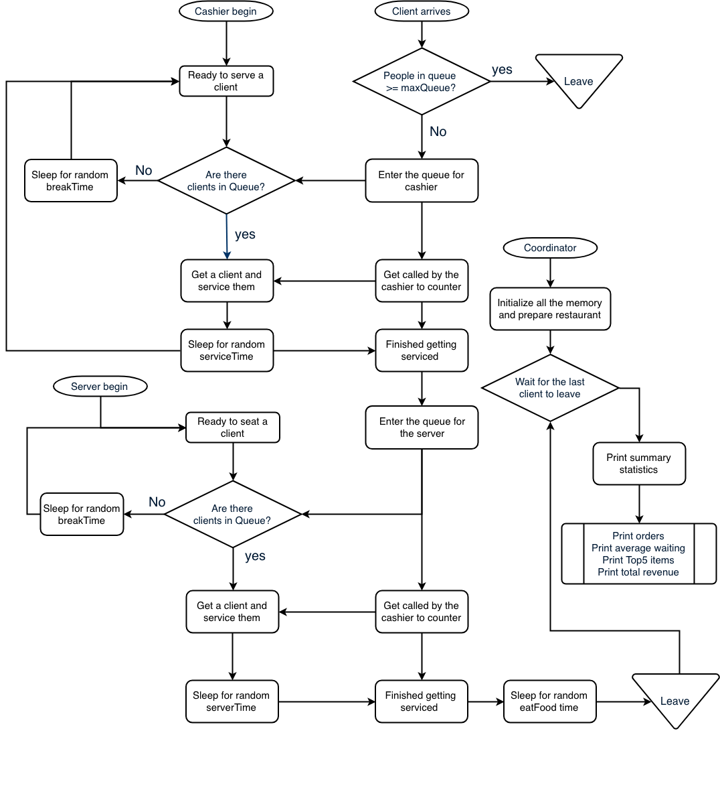

# 🍆 WestEndDiner 🍆
Simulating interprocess communication, scheduling and job processing in a restaurant setting.

---

West End Diner is a simulation of a restaurant using independent `client`, `cashier`, and `server` processes. It does this through the use of shared memory and semaphore IPCs which synchronizes and passes information across the independent participating programs.

---

#### Specifications of the restaurant:
* Clients processes arrive at random times and enter the cashier's queue
* The queue has a maximum size of `MAXQUEUE`. Clients cannot enter if the queue has reached `MAXQUEUE`.
* There can be any number of Cashiers who accept orders when they are free.
* If there are no people in the cashier queue then take a break between 1 and `breakTime`.
* Cashiers service the client between 1 and `serviceTime` during which they cannot service another client.
* Clients wait while their food is being prepared as specified in the menu.
* After the food is prepared, the client waits to be seated by the served which takes between 1 and serverTime.
* After eating the food for some time, the client can safely leave the restaurant.
* After the last client in the restaurant leaves, the restaurant can print summary statistics such as:

```
Average waiting in cashier queue 2.80 seconds
Average waiting for food 14.00 seconds
Average in server queue 0.50 seconds

Served a total of 10 clients generating $61.30 in revenue

//Top items
0. id 8, Club-Sandwich, ordered 3 times generating: 19.05
1. id 19, Mocha, ordered 2 times generating: 6.50
2. id 7, Mongolian-BBQ-Plate, ordered 2 times generating: 19.50
3. id 3, Garden-Salad, ordered 2 times generating: 9.50
4. id 5, Ceasars-Salad, ordered 1 times generating: 6.75
```

---

#### To build the project:

```
$ git clone
$ make
```
Cleaning object and build files:
```
$ make clean
```
Run the coordinator to initialize all shared memory and semaphores:
```
$ ./coordinator
```
The coordinator will output a `shmid` shared memory ID. You can pass this using the flag -m to our cashier/client/servers. However, You can also execute the programs because the same `SHMKEY (key_t)` is used to acquire the shared memory segment across the programs.

To run the `Cashier` / `Client` / `Server`
```
$ ./cashier -s serviceTime -b breakTime e.g -s 5 -b 10
$ ./server -s serviceTime -b breakTime e.g -s 3 -b 3
$ ./client -i itemId -e eatingTime e.g -i 8 -e 2
```
The script `spawn.sh` coordinates and simulates `13 clients` accessing the restaurant with `2 cashiers` and `1 server`. It can be modified to any number of clients and cashiers. The `keepalive.sh` script is needed to keep the terminal open after spawning and executing our command.
```
./spawn.sh
```


You can change program settings in `shared.h`
```
#define TOTALPEOPLE 10 //Total number of people that can be served by restaurant before shutting down
#define MAXQUEUE 5 //Maximum number of people in queue.
#define SHMKEY (key_t)6666 //Key used to create SHM
#define STRLEN 1024
```

The csv menu can also be modified or added to in `menu.txt`

---
#### Implementation details

In order to implement the program, a flowchart was designed to break down project as seen below:

<p align="center">
  
</p>

In order to build this, I used a number of semaphores and a shared memory structure to communicate between the processes represented by server, client and cashier. The following pseudocode illustrates the semaphores and SHM data used to synchronize the various processes.

* Coordinator:

```
1. Create and attach all of our semaphores.
2. Initialize and zero out an array of `struct clientData clients[TOTALPEOPLE]``
3. sem_wait(&shmdata -> coordinator_sem); //Waits for the last client to leave.
4. Print summary statistics
5. Mark the SHM to be deleted.
6. Detach the shared memory
```

* Cashier:

```
1. If shmid is specified, shmat(shmid) else shmget(SHMKEY)
loop {
  wait(Lock the cashier_lock_sem) //Ensure only one cashier is called
  Check the value of total_cashier_queue_sem is > 0.{
    wait(total_cashier_queue_sem) //Decrement the total queue.
    signal(cashier_queue_sem) // Signals a clien to come over,
    wait(cashier_signal) //Wait for client to come and write details down.

    int pid = shm clientpid
    signal(cashier_lock_sem) //Unlock cashier and lets other cashiers serve

    //Service the client
    // Find client block in our struct clientData clients struct;
    sem_post(paid_sem) //Tell the client that he is good to go.
  } else {
    signal(cashier_lock_sem) //Unlock the cashier
    //take a break
  }

}
```

* Client:

```
1. Find the details of the order in menu.
2. If shmid is specified, shmat(shmid) else shmget(SHMKEY)
3. wait(lock_sem) //Lock the vector to ensure integrity
4. Check if total_cashier_queue_sem+1 is >= MAXQUEUE; Exit
5. Check if shm numclents >= TOTALPEOPLE; exit
6. Add our information to array of clients. sem_init our cashier semaphore.
7. signal(total_cashier_queue_sem) //Increase the number of people in queue.
8. signal (lock_sem) //Unlock array
9. signal(cashier_signal)
10. wait(cashier_queue_sem) //Cashier calls us
11. Write order into SHM and signal(cashier_signal) to say we are done.
12. sem_wait(paid_sem) on our client's semaphore to wait for us to pay.
13. Wait for food to be cooked.
14. signal(total_server_queue_sem) // So clients can track their position.
15. wait(server_queue_sem) //Wait for server to cal us.
16. wait(client_signal) //Server is done seating us.
17. Eat food.
19. Lock the lock_sem. //To ensure integrity.
20. If we are the last person, signal(coordinator_sem)
21. Unlock the lock_sem
```

* Server:

```
1. If shmid is specified, shmat(shmid) else shmget(SHMKEY)
loop {
  Check the value of total_server_queue_sem is > 0.{
    wait(total_server_queue_sem) //Decrease the queue count. For tracking purposes.
    signal(server_queue_sem) //Tells client to come over.
    /* Serve the client */
    signal(client_signal) //Tells client we are done.
  } else {
    //take a break
  }
}

```

---
